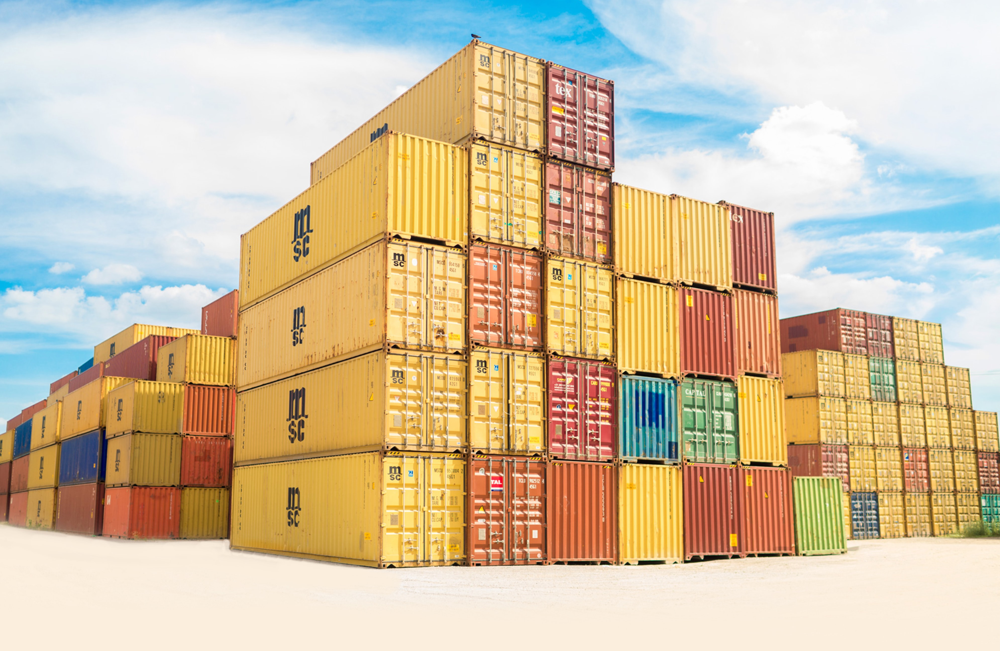

```{r setup, include=FALSE}
knitr::opts_chunk$set(echo = FALSE)

library(tidyverse)
library(ggrepel)
library(plotly)
library(ggthemes)
library(dplyr)
library(viridis)
library(readxl)
library(knitr)
library(kableExtra)
library(scales)
library(DT)
# Induct Ethanol Excel Sheet - Main
Main <- read_excel("C:/Users/omer.sharif/Desktop/Office Computer/Capstone/R Codes/Ethanol Dashboard/Aug 2021/Main.xlsm")

```


```{r echo=FALSE,out.width='100%'}

knitr::include_graphics('./img/logo.jpg')

```

# MOTIVATION

This report is computer generated. 

- Unlike Excel or any other point and click program here, consistency and accuracy of report is guaranteed no matter the size. Only within a fraction of time it takes on Excel, a very complicated analysis can be generated.

- Everything below is the result of **computations** performed on _Ethanol Exports Database_ by computer program and displayed in the form of tables and charts.Any computer program can be used for the purpose.[Click here for a list of computer languages.](https://pypl.github.io/PYPL.html)

- This method of reporting is not plagued by weaknesses of _Microsoft Excel_ and _Microsoft Access Dashboards._ 


- All prices and value of ethanol are in _US Dollar on per metric ton basis indicated as M.Tons (Metric Tons)._ All quantities are in _Metric tons indicated as (M.Tons)._

- [Click Here For Microsoft Excel Dashboard](https://app.box.com/s/fptugum4hq1ue8jqrle4bck3xm6db0xs)

- [Click Here For Microsoft Access Dashboard](https://app.box.com/s/r1jdidzbvmo997n1ddtnla3n9scnea69)


### **Year Wise Summary**
```{r,message=FALSE}
Yearwise_Summary<- Main %>% group_by(Year) %>% summarize('Qty in M.Tons'= format(round(sum(`QTY. (MT)`),2),big.mark=",",digits=2,nsmall=2,scientific=FALSE),'Value in Mil.USD' = format(round(sum(`VALUE ($USD)`)/1000000,2),big.mark=",",digits=2,nsmall=2,scientific=FALSE))%>% arrange(desc(Year))
Yearwise_Summary %>% kbl(caption = "Ethanol Summary Year Wise") %>% kable_classic_2(full_width = F)

```

### **Storage Wise Summary**
```{r,message=FALSE}

Storagewise_Summary<- Main %>% group_by(`Storage Type`) %>% summarize('Qty in M.Ton'= format(round(sum(`QTY. (MT)`),2),big.mark=",",digits=2,nsmall=2,scientific=FALSE),'Value in Mil.USD' = format(round(sum(`VALUE ($USD)`)/1000000,2),big.mark=",",digits=2,nsmall=2,scientific=FALSE)) 
Storagewise_Summary %>% kbl(caption = "Ethanol Summary by Mode of Shipment") %>% kable_classic_2(full_width = F)

```

### **Product Wise Summary**
```{r,message=FALSE}
Productwise_Summary <- Main %>% group_by(Product) %>% summarise(`Qty in M.Tons`= format(round(sum(`QTY. (MT)`),2),big.mark=",",digits=2,nsmall=2,scientific=FALSE),`Value in Mil.USD` = format(round(sum(`VALUE ($USD)`)/1000000,2),big.mark=",",digits=2,nsmall=2,scientific=FALSE),
                                                                `Max M.Ton Price` = (round(max(`M.Ton Price`),2)),`Min M.Ton Price` = (round(min(`M.Ton Price`),2)),
                                                                `Mean M.Ton Price` = (round(mean(`M.Ton Price`),2))) %>% arrange(`Qty in M.Tons`)

Productwise_Summary %>% kbl(caption = "Ethanol Summary by Product") %>% kable_classic_2(full_width = F)

```

### **Regionwise Summary**
```{r,message=FALSE}
Regionwise_Summary <- Main %>% group_by(REGION) %>% summarise(`Qty in M.Tons`= format(round(sum(`QTY. (MT)`),2),big.mark=",",digits=2,nsmall=2,scientific=FALSE),`Value in Mil.USD` = format(round(sum(`VALUE ($USD)`)/1000000,2),big.mark=",",digits=2,nsmall=2,scientific=FALSE),`Max.M.Ton Price` = round(max(`M.Ton Price`),2),`Min.M.Ton Price` = round(min(`M.Ton Price`),2),`Mean M.Ton Price` = round(mean(`M.Ton Price`),2)) %>% arrange(`Qty in M.Tons`)
Regionwise_Summary %>% kbl(caption = "Ethanol Summary by Region") %>% kable_classic_2(full_width = F)

```


```{r echo=FALSE,out.width='100%'}

knitr::include_graphics('./img/logo_a.jpg')

```

# 1. TREND ANALYSIS

### **Quantitywise Trends**

**I. Year wise Data**
```{r,message=FALSE}
Yearwise_Summary<- Main %>% group_by(Year) %>% summarize(`Qty in M.Tons (Thousand)`= format(round(sum(`QTY. (MT)`)/1000,2),big.mark=",",digits=2,nsmall=2,scientific=FALSE)) %>% arrange(desc(Year))
Yearwise_Summary <- Yearwise_Summary %>% pivot_wider(names_from = Year,values_from = `Qty in M.Tons (Thousand)`)
Yearwise_Summary %>% kbl(caption = "Yearwise Quantity in M.Ton (Thousands)") %>% kable_classic_2(full_width = F)

```

**a. Month wise Data**
```{r,message=FALSE}
Main_Qtywise <- Main %>% group_by(Year,Month) %>% summarise(Qty=format(round(sum(`QTY. (MT)`)/1000,2),big.mark=",",digits=2,nsmall=2,scientific=FALSE))
all_months = c("Jan","Feb","Mar","Apr","May","Jun","Jul","Aug","Sep","Oct","Nov","Dec")
Main_Qtywise$Month <- factor(Main_Qtywise$Month,levels=all_months)
Main_Qtywise <- Main_Qtywise %>% arrange(Year,Month)
Main_Qtywise <- Main_Qtywise %>% pivot_wider(names_from = Year,values_from = Qty)
Main_Qtywise %>% kbl(caption = "Monthwise Quantity in M.Ton (Thousands)") %>% kable_classic_2(full_width = F)
```

**b. Month wise Trend**
```{r, message=FALSE,fig.width=12,fig.height=8}
Main_Qtywise <- Main %>% group_by(Year,Month) %>% summarise(Qty=round(sum(`QTY. (MT)`)/1000,2))
all_months = c("Jan","Feb","Mar","Apr","May","Jun","Jul","Aug","Sep","Oct","Nov","Dec")
Main_Qtywise$Month <- factor(Main_Qtywise$Month,levels=all_months)
Main_Qtywise <- Main_Qtywise %>% arrange(Year,Month)
p <- ggplot(data=Main_Qtywise,aes(x=Month,y=Qty,fill=Month)) + geom_col() + geom_label_repel(aes(label=Qty),alpha=0.7,fontface='bold',fill=NA,label.size=NA,size=4,min.segment.length=0) + facet_wrap(Year~.)
p <- p + theme(legend.position = "",plot.title= element_text(hjust=0.5)) + ggtitle("ETHANOL QUANTITY TREND") + xlab("Month") + ylab("M.Ton (in Thousand)") + scale_fill_viridis_d()
p

```


**II. Product wise Summary**

**a. Year wise Data**
```{r, message=FALSE,fig.width=12,fig.height=8}
Productwise_Summary <- Main %>% group_by(Year,Product) %>% summarise(`Qty in M.Tons (Thousands)`= format(round(sum(`QTY. (MT)`)/1000,2),big.mark=",",digits=2,nsmall=2,scientific=FALSE)) %>% arrange(Year)
Productwise_Summary <- Productwise_Summary %>% pivot_wider(names_from = Year,values_from = `Qty in M.Tons (Thousands)`)
Productwise_Summary %>% kbl(caption = "Quantity in M.Ton (Thousands)") %>% kable_classic_2(full_width = F)

```

**b. Month wise Data**
```{r,message = FALSE}
Productwise_Summary <- Main %>% group_by(Year,Month,Product) %>% summarise(`Qty in M.Tons (Thousands)`= format(round(sum(`QTY. (MT)`)/1000,2),big.mark=",",digits=2,nsmall=2,scientific=FALSE)) %>% arrange(`Qty in M.Tons (Thousands)`)
all_months = c("Jan","Feb","Mar","Apr","May","Jun","Jul","Aug","Sep","Oct","Nov","Dec")
Productwise_Summary$Month <- factor(Productwise_Summary$Month,levels=all_months)
Productwise_Summary <- Productwise_Summary %>% arrange(desc(Year),desc(Month))
Productwise_Summary <- Productwise_Summary %>% pivot_wider(names_from = Product,values_from = `Qty in M.Tons (Thousands)`)
datatable(Productwise_Summary,options = list(pageLength=5),caption="Quantity in M.Ton(Thousands)")
```


**c. Month wise Trend**
```{r, message=FALSE,fig.width=12,fig.height=8}
Main_Qtywise_Product <- Main %>% group_by(Year,Month,Product) %>% summarise(Qty=round(sum(`QTY. (MT)`)/1000,2))
all_months = c("Jan","Feb","Mar","Apr","May","Jun","Jul","Aug","Sep","Oct","Nov","Dec")
Main_Qtywise_Product$Month <- factor(Main_Qtywise_Product$Month,levels=all_months)
Main_Qtywise_Product <- Main_Qtywise_Product %>% arrange(Year,Month)
p <- ggplot(data=Main_Qtywise_Product,aes(x=Month,y=Qty,fill=Month)) + geom_col() + geom_label_repel(aes(label= Qty),alpha=0.6,fontface='bold',fill=NA,label.size=NA,size=3,min.segment.length=0) + facet_grid(Product~Year) 
p <- p + theme(legend.position = "",plot.title= element_text(hjust=0.5),axis.text.x = element_text(size=7)) + ggtitle("PRODUCT TREND BY QUANTITY") + xlab("Month") + ylab("M.Ton (in Thousand)") + scale_fill_viridis_d()
p

```

**III. Region wise Trend**

**a. Year wise Data**
```{r, message=FALSE,fig.width=12,fig.height=8}
Regionwise_Summary <- Main %>% group_by(Year,REGION)%>% summarise(`Qty in M.Tons (Thousands)`=format(round(sum(`QTY. (MT)`)/1000,2),big.mark=",",digits=2,nsmall=2,scientific=FALSE)) %>% arrange(Year)
Regionwise_Summary <- Regionwise_Summary %>% pivot_wider(names_from = Year,values_from = `Qty in M.Tons (Thousands)`)
Regionwise_Summary %>% kbl(caption = "Quantity in M.Ton (Thousands)") %>% kable_classic_2(full_width = F)

```


**b. Month wise Data**
```{r, message=FALSE,fig.width=12,fig.height=8}
Regionwise_Summary <- Main %>% group_by(Year,Month,REGION) %>% summarise(`Qty in M.Ton (Thousands)`= round(sum(`QTY. (MT)`)/1000,2)) %>% arrange(desc(`Qty in M.Ton (Thousands)`))
all_months = c("Jan","Feb","Mar","Apr","May","Jun","Jul","Aug","Sep","Oct","Nov","Dec")
Regionwise_Summary$Month <- factor(Regionwise_Summary$Month,levels=all_months)
Regionwise_Summary <- Regionwise_Summary %>% arrange(desc(Year),desc(Month))
Regionwise_Summary <- Regionwise_Summary %>% pivot_wider(names_from = REGION,values_from = `Qty in M.Ton (Thousands)`)
datatable(Regionwise_Summary,options = list(pageLength=5),caption="Quantity in M.Ton (Thousands)")

```

**c. Month wise Trend**
```{r, message=FALSE,fig.width=12,fig.height=8}
Main_Qtywise_Region <- Main %>% group_by(Year,Month,REGION) %>% summarise(Qty=round(sum(`QTY. (MT)`)/1000,2))
all_months = c("Jan","Feb","Mar","Apr","May","Jun","Jul","Aug","Sep","Oct","Nov","Dec")
Main_Qtywise_Region$Month <- factor(Main_Qtywise_Region$Month,levels=all_months)
Main_Qtywise_Region <- Main_Qtywise_Region %>% arrange(Year,Month)
p <- ggplot(data=Main_Qtywise_Region,aes(x=Month,y=Qty,fill=Month)) + geom_col() + geom_label_repel(aes(label= Qty),alpha=0.6,fontface='bold',fill=NA,label.size=NA,size=3,min.segment.length=0) + facet_grid(REGION~Year) 
p <- p + theme(legend.position = "",plot.title= element_text(hjust=0.5),axis.text.x = element_text(size=7)) + ggtitle("REGION TREND BY QUANTITY") + xlab("Month") + ylab("M.Ton (in Thousand)") + scale_fill_viridis_d()
p
```

**IV. Mode of Shipment** 

**a. Year wise Data**
```{r, message=FALSE,fig.width=12,fig.height=8}
Storagewise_Summary <- Main %>% group_by(Year,`Storage Type`)%>% summarise(`Qty in M.Tons (Thousands)`=format(round(sum(`QTY. (MT)`)/1000,2),big.mark=",",digits=2,nsmall=2,scientific=FALSE)) %>% arrange(Year)
Storagewise_Summary <- Storagewise_Summary %>% pivot_wider(names_from = Year,values_from = `Qty in M.Tons (Thousands)`)
Storagewise_Summary %>% kbl(caption = "Quantity in M.Ton (Thousands)") %>% kable_classic_2(full_width = F)

```

**b. Month wise Data**
```{r, message=FALSE,fig.width=12,fig.height=8}
Storagewise_Summary <- Main %>% group_by(Year,Month,`Storage Type`) %>% summarise(`Qty in M.Ton (Thousands)`= round(sum(`QTY. (MT)`)/1000,2)) %>% arrange(desc(`Qty in M.Ton (Thousands)`))
all_months = c("Jan","Feb","Mar","Apr","May","Jun","Jul","Aug","Sep","Oct","Nov","Dec")
Storagewise_Summary$Month <- factor(Storagewise_Summary$Month,levels=all_months)
Storagewise_Summary <- Storagewise_Summary %>% arrange(desc(Year),desc(Month))
Storagewise_Summary <- Storagewise_Summary %>% pivot_wider(names_from = `Storage Type`,values_from = `Qty in M.Ton (Thousands)`)
datatable(Storagewise_Summary,options = list(pageLength=5),caption="Quantity in M.Ton (Thousands)")
```

**c. Month wise Trend**
```{r, message=FALSE,fig.width=12,fig.height=8}
Main_Qtywise_StorageType <- Main %>% group_by(Year,Month,`Storage Type`) %>% summarise(Qty=round(sum(`QTY. (MT)`)/1000,2))
all_months = c("Jan","Feb","Mar","Apr","May","Jun","Jul","Aug","Sep","Oct","Nov","Dec")
Main_Qtywise_StorageType$Month <- factor(Main_Qtywise_StorageType$Month,levels=all_months)
Main_Qtywise_StorageType <- Main_Qtywise_StorageType %>% arrange(Year,Month)
p <- ggplot(data=Main_Qtywise_StorageType,aes(x=Month,y=Qty,fill=Month)) + geom_col() + geom_label_repel(aes(label= Qty),alpha=0.6,fontface='bold',fill=NA,label.size=NA,size=3,min.segment.length=0) + facet_grid(`Storage Type`~Year) 
p <- p + theme(legend.position = "",plot.title= element_text(hjust=0.5),axis.text.x = element_text(size=7)) + ggtitle("MODE OF SHIPMENT TREND BY QUANTITY") + xlab("Month") + ylab("M.Ton (in Thousand)") + scale_fill_viridis_d()
p
```


```{r echo=FALSE,out.width='100%'}

knitr::include_graphics('./img/logo_b.jpg')

```


### **Valuewise Trends**

**I. Year wise Data**
```{r, message=FALSE,fig.width=12,fig.height=8}
Yearwise_Summary<- Main %>% group_by(Year) %>% summarize(`Value in Mil.USD`= round((sum(`VALUE ($USD)`))/1000000,2)) %>% arrange(Year)
Yearwise_Summary <- Yearwise_Summary %>% pivot_wider(names_from = Year,values_from = `Value in Mil.USD`)
Yearwise_Summary %>% kbl(caption = "Value in Million USD") %>% kable_classic_2(full_width = F)

```

**a. Month wise Data**
```{r, message=FALSE,fig.width=12,fig.height=8}
Main_Valuewise <- Main %>% group_by(Year,Month) %>% summarise(Value=round(sum(`VALUE ($USD)`)/1000000,2))
all_months = c("Jan","Feb","Mar","Apr","May","Jun","Jul","Aug","Sep","Oct","Nov","Dec")
Main_Valuewise$Month <- factor(Main_Valuewise$Month,levels=all_months)
Main_Valuewise <- Main_Valuewise %>% arrange(Year,Month)
Main_Valuewise <- Main_Valuewise %>% pivot_wider(names_from = Year,values_from = Value)
Main_Valuewise %>% kbl(caption = "Monthwise Value in Million USD") %>% kable_classic_2(full_width = F)

```

**b. Month wise Trend**
```{r, message=FALSE,fig.width=12,fig.height=8}
Main_Valuewise <- Main %>% group_by(Year,Month) %>% summarise(Value=round(sum(`VALUE ($USD)`)/1000000,2))
all_months = c("Jan","Feb","Mar","Apr","May","Jun","Jul","Aug","Sep","Oct","Nov","Dec")
Main_Valuewise$Month <- factor(Main_Valuewise$Month,levels=all_months)
Main_Valuewise <- Main_Valuewise %>% arrange(Year,Month)

p <- ggplot(data=Main_Valuewise,aes(x=Month,y=Value,fill=Month)) + geom_col() + geom_label_repel(aes(label= Value),alpha=0.7,fontface='bold',fill=NA,label.size=NA,size=4,min.segment.length=0) + facet_wrap(Year~.)
p <- p + theme(legend.position = "",plot.title= element_text(hjust=0.5)) + ggtitle("ETHANOL VALUE TREND") + xlab("Month") + ylab("Million USD") + scale_fill_viridis_d()
p


```

**II.Product Trend**

**a. Year wise Data**
```{r, message=FALSE,fig.width=12,fig.height=8}
Productwise_Summary <- Main %>% group_by(Year,Product) %>% summarise(`Value in Mil.USD`= round(sum(`VALUE ($USD)`/1000000),2)) %>% arrange(Year,desc(`Value in Mil.USD`))
Productwise_Summary <- Productwise_Summary %>% pivot_wider(names_from = Year,values_from = `Value in Mil.USD`) 
Productwise_Summary %>% kbl(caption = "Value in Million USD") %>% kable_classic_2(full_width = F)

```

**b. Month wise Data**
```{r, message=FALSE,fig.width=12,fig.height=8}
Productwise_Summary <- Main %>% group_by(Year,Month,Product) %>% summarise(Value= round(sum(`VALUE ($USD)`)/1000000,2)) %>% arrange(desc(Value))
all_months = c("Jan","Feb","Mar","Apr","May","Jun","Jul","Aug","Sep","Oct","Nov","Dec")
Productwise_Summary$Month <- factor(Productwise_Summary$Month,levels=all_months)
Productwise_Summary <- Productwise_Summary %>% arrange(desc(Year),desc(Month))
Productwise_Summary <- Productwise_Summary %>% pivot_wider(names_from = Product,values_from = Value)
datatable(Productwise_Summary,options = list(pageLength=5),caption="Value in Million USD") 

```

**c. Month wise Trend**
```{r ,message=FALSE,fig.width=12,fig.height=8}
Main_Valuewise_Product <- Main %>% group_by(Year,Month,Product) %>% summarise(Value=round(sum(`VALUE ($USD)`)/1000000,2))
all_months = c("Jan","Feb","Mar","Apr","May","Jun","Jul","Aug","Sep","Oct","Nov","Dec")
Main_Valuewise_Product$Month <- factor(Main_Valuewise_Product$Month,levels=all_months)
Main_Valuewise_Product <- Main_Valuewise_Product %>% arrange(Year,Month)
p <- ggplot(data=Main_Valuewise_Product,aes(x=Month,y=Value,fill=Month)) + geom_col() + geom_label_repel(aes(label= Value),alpha=0.6,fontface='bold',fill=NA,label.size=NA,size=3,min.segment.length=0) + facet_grid(Product~Year) 
p <- p + theme(legend.position = "",plot.title= element_text(hjust=0.5),axis.text.x = element_text(size=7)) + ggtitle("PRODUCT TREND BY VALUE") + xlab("Month") + ylab("Million USD") + scale_fill_viridis_d()
p
```


**III. Regionwise Trend**

**a. Year wise Data**
```{r, message=FALSE,fig.width=12,fig.height=8}
Regionwise_Summary <- Main %>% group_by(Year,REGION)%>% summarise(`Value in Mil.USD`=round(sum(`VALUE ($USD)`/1000000),2)) %>% arrange(Year,desc(`Value in Mil.USD`))
Regionwise_Summary <- Regionwise_Summary %>% pivot_wider(names_from = Year,values_from = `Value in Mil.USD`)
Regionwise_Summary %>% kbl(caption = "Value in Million USD") %>% kable_classic_2(full_width = F)


```

**b. Month wise Data**
```{r,message = FALSE}
Regionwise_Summary <- Main %>% group_by(Year,Month,REGION) %>% summarise(Value= round(sum(`VALUE ($USD)`)/1000000,2)) %>% arrange(desc(Value))
all_months = c("Jan","Feb","Mar","Apr","May","Jun","Jul","Aug","Sep","Oct","Nov","Dec")
Regionwise_Summary$Month <- factor(Regionwise_Summary$Month,levels=all_months)
Regionwise_Summary <- Regionwise_Summary %>% arrange(desc(Year),desc(Month))
Regionwise_Summary <- Regionwise_Summary %>% pivot_wider(names_from = REGION,values_from = Value)
datatable(Regionwise_Summary,options = list(pageLength=5),caption="Value in Million USD")

```

**c. Month wise Trend**
```{r, message=FALSE,fig.width=12,fig.height=8}
Main_Valuewise_Region <- Main %>% group_by(Year,Month,REGION) %>% summarise(Value=round(sum(`VALUE ($USD)`)/1000000,2))
all_months = c("Jan","Feb","Mar","Apr","May","Jun","Jul","Aug","Sep","Oct","Nov","Dec")
Main_Valuewise_Region$Month <- factor(Main_Valuewise_Region$Month,levels=all_months)
Main_Valuewise_Region <- Main_Valuewise_Region %>% arrange(Year,Month)
p <- ggplot(data=Main_Valuewise_Region,aes(x=Month,y=Value,fill=Month)) + geom_col() + geom_label_repel(aes(label= Value),alpha=0.6,fontface='bold',fill=NA,label.size=NA,size=3,min.segment.length=0) + facet_grid(REGION~Year) 
p <- p + theme(legend.position = "",plot.title= element_text(hjust=0.5),axis.text.x = element_text(size=7)) + ggtitle("REGION TREND BY VALUE") + xlab("Month") + ylab("Million USD") + scale_fill_viridis_d()
p

```

**IV. Mode of Shipment Trend**

**a. Year wise Data**
```{r, message=FALSE,fig.width=12,fig.height=8}
Storagewise_Summary <- Main %>% group_by(Year,`Storage Type`)%>% summarise(`Value in Mil.USD`=round(sum(`VALUE ($USD)`/1000000),2)) %>% arrange(Year)
Storagewise_Summary <- Storagewise_Summary %>% pivot_wider(names_from = Year,values_from = `Value in Mil.USD`)
Storagewise_Summary %>% kbl(caption = "Value in Million USD") %>% kable_classic_2(full_width = F)
```

**b. Month wise Data**
```{r, message=FALSE,fig.width=12,fig.height=8}
Storagewise_Summary <- Main %>% group_by(Year,Month,`Storage Type`) %>% summarise(Value= round(sum(`VALUE ($USD)`)/1000000,2)) %>% arrange(desc(Value))
all_months = c("Jan","Feb","Mar","Apr","May","Jun","Jul","Aug","Sep","Oct","Nov","Dec")
Storagewise_Summary$Month <- factor(Storagewise_Summary$Month,levels=all_months)
Storagewise_Summary <- Storagewise_Summary %>% arrange(desc(Year),desc(Month))
Storagewise_Summary <- Storagewise_Summary %>% pivot_wider(names_from = `Storage Type`,values_from = Value)
datatable(Storagewise_Summary,options = list(pageLength=5),caption="Value in Million USD")
```

**c. Month wise Trend**
```{r, message=FALSE,fig.width=12,fig.height=8}
Main_Valuewise_StorageType <- Main %>% group_by(Year,Month,`Storage Type`) %>% summarise(Value=round(sum(`VALUE ($USD)`)/1000000,2))
all_months = c("Jan","Feb","Mar","Apr","May","Jun","Jul","Aug","Sep","Oct","Nov","Dec")
Main_Valuewise_StorageType$Month <- factor(Main_Valuewise_StorageType$Month,levels=all_months)
Main_Valuewise_StorageType <- Main_Valuewise_StorageType %>% arrange(Year,Month)
p <- ggplot(data=Main_Valuewise_StorageType,aes(x=Month,y=Value,fill=Month)) + geom_col() +  geom_label_repel(aes(label= Value),alpha=0.6,fontface='bold',fill=NA,label.size=NA,size=3,min.segment.length=0) + facet_grid(`Storage Type`~Year) 
p <- p + theme(legend.position = "",plot.title= element_text(hjust=0.5),axis.text.x = element_text(size=7)) + ggtitle("MODE OF SHIPMENT TREND BY VALUE") + xlab("Month") + ylab("Million USD") + scale_fill_viridis_d()
p

```


### **Summary**

```{r, message=FALSE}
Main_QtyValuewise <- Main %>% group_by(Year,Month) %>% summarise(Qty=round(sum(`QTY. (MT)`)/1000,2),Value=round(sum(`VALUE ($USD)`)/1000000,2))
all_months = c("Jan","Feb","Mar","Apr","May","Jun","Jul","Aug","Sep","Oct","Nov","Dec")
Main_QtyValuewise$Month <- factor(Main_QtyValuewise$Month,levels=all_months)
Main_QtyValuewise <- Main_QtyValuewise %>% arrange(Year,Month)
datatable(Main_QtyValuewise,caption="Quantity in Thousand M.Ton | Value in Million USD",options = list(pageLength=5))

```


```{r echo=FALSE,out.width='100%'}



```


# 2. ANALYSIS BY PRODUCT

* `The major contribution of exports from Pakistan are due to:`
```{r, message=FALSE,fig.width=12,fig.height=8}
Count_Product <- Main %>% group_by(Product) %>% summarise(Quantity=sum(`QTY. (MT)`)) %>% arrange(desc(Quantity))
kable(Count_Product[1,1])
```

* `Among all regions in the world following has some of the highest prices overall`
```{r, message=FALSE,fig.width=12,fig.height=8}
Highest_Prices <- Main %>% group_by(REGION) %>% summarise(Maximum_Price = max(`M.Ton Price`)) %>% arrange(desc(Maximum_Price))
kable(Highest_Prices[1,1])
#kbl(Highest_Prices[1,1]) %>% kable_classic_2(full_width = F)
```


### **Quantitywise Trends**

**a. Yearwise Summary**
```{r ,message=FALSE,fig.width=12,fig.height=8}
Year <- as.factor(Main$Year)
Qty_in_MTon <- Main %>% group_by(Year,Product) %>% summarise(`Qty in M.Ton` = format(round(sum(`M.Ton Price`)/1000,2),big.mark=",",digits=2,nsmall=2,scientific=FALSE)) %>% arrange(desc(Year),`Qty in M.Ton`)
                                                             
Qty_in_MTon  <- Qty_in_MTon %>% pivot_wider(names_from = Year, values_from = `Qty in M.Ton`)

Qty_in_MTon %>% kbl(caption = "Quantity in Thousand M.Ton") %>% kable_classic_2(full_width = F)
```

**b. Productwise Summary**
```{r, message=FALSE,fig.width=12,fig.height=8}
Productwise_Summary <- Main %>% group_by(Product,REGION) %>% summarise(`Qty in M.Ton (Thousands)`= round(sum(`QTY. (MT)`)/1000,2)) %>% arrange(desc(`Qty in M.Ton (Thousands)`))
Productwise_Summary <- Productwise_Summary %>% pivot_wider(names_from = REGION,values_from = `Qty in M.Ton (Thousands)`)
Productwise_Summary %>% kbl(caption = "Qty in M.Ton (Thousands)") %>% kable_classic_2(full_width = F)

```

**c. Storage Type Summary**
```{r, message=FALSE,fig.width=12,fig.height=8}
Productwise_Summary <- Main %>% group_by(Product,`Storage Type`) %>% summarise(`Qty in M.Ton (Thousands)`= format(round(sum(`QTY. (MT)`)/1000,2),big.mark=",",digits=2,nsmall=2,scientific=FALSE)) %>% arrange(`Qty in M.Ton (Thousands)`)
Productwise_Summary <- Productwise_Summary %>% pivot_wider(names_from = `Storage Type`,values_from = `Qty in M.Ton (Thousands)`)
Productwise_Summary %>% kbl(caption = "Qty in M.Ton (Thousands)") %>% kable_classic_2(full_width = F)

```

**d. Exporter Summary**
```{r, message=FALSE,fig.width=12,fig.height=8}
Productwise_Summary <- Main %>% group_by(Product,EXPORTER) %>% summarise(`Qty in M.Ton (Thousands)`= round(sum(`QTY. (MT)`)/1000,2)) %>% arrange(desc(`Qty in M.Ton (Thousands)`))
Productwise_Summary <- Productwise_Summary %>% pivot_wider(names_from = Product,values_from = `Qty in M.Ton (Thousands)`)
Productwise_Summary %>% kbl(caption = "Qty in M.Ton (Thousands)") %>% kable_classic_2(full_width = F)

```

**e. Importer Summary**
```{r, message=FALSE,fig.width=12,fig.height=8}
Productwise_Summary <- Main %>% group_by(Product,IMPORTER) %>% summarise(`Qty in M.Ton (Thousands)`= round(sum(`QTY. (MT)`)/1000,2)) %>% arrange(desc(`Qty in M.Ton (Thousands)`))
Productwise_Summary <- Productwise_Summary %>% pivot_wider(names_from = Product,values_from = `Qty in M.Ton (Thousands)`)
datatable(Productwise_Summary,options = list(pageLength=5),caption="Quantity in M.Ton")
```


```{r echo=FALSE,out.width='100%'}

knitr::include_graphics('./img/logo_d.jpg')

```


### **Valuewise Trends**

**a. Year wise Summary**
```{r, message=FALSE}
Year <- as.factor(Main$Year)
Values_in_Mil_USD <- Main %>% group_by(Year,Product) %>% summarise(`Value in Mil.USD` = round(sum(`VALUE ($USD)`)/1000000,2)) %>% arrange(desc(Year),desc(`Value in Mil.USD`))
Values_in_Mil_USD <- Values_in_Mil_USD %>% pivot_wider(names_from = Year, values_from = `Value in Mil.USD`)

Values_in_Mil_USD %>% kbl(caption = "Value in Million USD") %>% kable_classic_2(full_width = F)

```

**b. Product wise Summary**
```{r, message=FALSE,fig.width=12,fig.height=8}
Productwise_Summary <- Main %>% group_by(Product,REGION) %>% summarise(Value= round(sum(`VALUE ($USD)`)/1000000,2)) %>% arrange(desc(Value))
Productwise_Summary <- Productwise_Summary %>% pivot_wider(names_from = REGION,values_from = Value)
Productwise_Summary %>% kbl(caption = "Value in Million USD") %>% kable_classic_2(full_width = F)
```

**c. Storage Type Summary**
```{r ,message=FALSE,fig.width=12,fig.height=8}
Productwise_Summary <- Main %>% group_by(Product,`Storage Type`) %>% summarise(Value= round(sum(`VALUE ($USD)`)/1000000,2)) %>% arrange(desc(Value))
Productwise_Summary <- Productwise_Summary %>% pivot_wider(names_from = `Storage Type`,values_from = Value)
Productwise_Summary %>% kbl(caption = "Value in Million USD") %>% kable_classic_2(full_width = F)
```

**d. Exporter Summary`**
```{r, message=FALSE,fig.width=12,fig.height=8}
Productwise_Summary <- Main %>% group_by(Product,EXPORTER) %>% summarise(Value= round(sum(`VALUE ($USD)`)/1000000,2)) %>% arrange(desc(Value))
Productwise_Summary <- Productwise_Summary %>% pivot_wider(names_from = Product,values_from = Value)
Productwise_Summary %>% kbl(caption = "Value in Million USD") %>% kable_classic_2(full_width = F)
```

**e. Importer Summary**
```{r ,message=FALSE,fig.width=12,fig.height=8}
Productwise_Summary <- Main %>% group_by(Product,IMPORTER) %>% summarise(Value= round(sum(`VALUE ($USD)`)/1000000,2)) %>% arrange(desc(Value))
Productwise_Summary <- Productwise_Summary %>% pivot_wider(names_from = Product,values_from = Value)
datatable(Productwise_Summary,options = list(pageLength=5),caption="Value in Million USD")
```


[Product Wise Details Available Here](https://engromersharif.github.io/products/)
```{r, message=FALSE,fig.align='center',fig.width=12,fig.height=7}
REGION <- as.factor(Main$REGION)
p <- ggplot(data=Main,aes(x= DATE ,y=`M.Ton Price`,colour=REGION))
p <- p +  geom_jitter(alpha=0.6,size=1.5,shape=16) +
  theme(legend.position = "top",plot.title=element_text(hjust=0.5)) + labs(title="ETHANOL PRICES PER METRIC TON - YEAR 2017 TO 2021",x="YEAR",y="M.Ton Price")
p <- p + facet_grid(.~Product) + scale_fill_viridis_d() + guides(fill="none") 
p

```


```{r echo=FALSE,out.width='100%'}

knitr::include_graphics('./img/logo_e.jpg')

```


# 3. ANALYSIS BY REGION

* `Highest volumes of exports went to: `
```{r, message=FALSE,fig.width=12,fig.height=8}
Highest_Quantity_Country <- Main %>% group_by(COUNTRY) %>% summarise(Quantity = sum(`QTY. (MT)`)) %>% arrange(desc(Quantity))

kable(Highest_Quantity_Country[1,1])
#Highest_Prices_Product[1,1]  %>% kbl() %>% kable_classic_2(full_width = F)

```

### **Quantitywise Trends**

* `By Quantity following has major contribution`
```{r,message=FALSE}
Region_Investigate<- Main %>% group_by(REGION) %>% summarise(Qty=sum(`QTY. (MT)`)) %>% arrange(desc(Qty))
kable(Region_Investigate[1,1])
```


**a. Year wise Summary**
```{r ,message=FALSE,fig.width=12,fig.height=8}
Year <- as.factor(Main$Year)
Qty_in_MTon <- Main %>% group_by(Year,REGION) %>% summarise(`Qty in M.Ton` = round(sum(`M.Ton Price`)/1000,2)) %>% arrange(desc(Year),desc(`Qty in M.Ton`))
                                                           
Qty_in_MTon  <- Qty_in_MTon %>% pivot_wider(names_from = Year, values_from = `Qty in M.Ton`)
Qty_in_MTon %>% kbl(caption = "Quantity in Thousand M.Ton") %>% kable_classic_2(full_width = F)


```

**b. Productwise Summary**
```{r, message=FALSE,fig.width=12,fig.height=8}
Year <- as.factor(Main$Year)
Qty_in_MTon <- Main %>% group_by(Product,REGION) %>% summarise(`Qty in M.Ton` = format(round(sum(`M.Ton Price`)/1000,2),big.mark=",",digits=2,nsmall=2,scientific=FALSE)) %>% arrange(desc(`Qty in M.Ton`))
                                                           
Qty_in_MTon  <- Qty_in_MTon %>% pivot_wider(names_from = Product, values_from = `Qty in M.Ton`)
Qty_in_MTon %>% kbl(caption = "Quantity in Thousand M.Ton") %>% kable_classic_2(full_width = F)

```

**c. Storage Type Summary**
```{r ,message=FALSE,fig.width=12,fig.height=8}
Year <- as.factor(Main$Year)
Qty_in_MTon <- Main %>% group_by(`Storage Type`,REGION) %>% summarise(`Qty in M.Ton` = format(round(sum(`M.Ton Price`)/1000,2),big.mark=",",digits=2,nsmall=2,scientific=FALSE)) %>% arrange(desc(`Qty in M.Ton`))
Qty_in_MTon  <- Qty_in_MTon %>% pivot_wider(names_from = `Storage Type` , values_from = `Qty in M.Ton`)
Qty_in_MTon %>% kbl(caption = "Quantity in Thousand M.Ton") %>% kable_classic_2(full_width = F)
```

**d. Exporter Summary**
```{r, message=FALSE,fig.width=12,fig.height=8}
Year <- as.factor(Main$Year)
Qty_in_MTon <- Main %>% group_by(EXPORTER,REGION) %>% summarise(`Qty in M.Ton` = round(sum(`M.Ton Price`)/1000,2)) %>% arrange(desc(`Qty in M.Ton`))
                                                           
Qty_in_MTon  <- Qty_in_MTon %>% pivot_wider(names_from = REGION, values_from = `Qty in M.Ton`)
Qty_in_MTon %>% kbl(caption = "Quantity in Thousand M.Ton") %>% kable_classic_2(full_width = F)
```


**e. Importer Summary**
```{r, message=FALSE,fig.width=12,fig.height=8}
Year <- as.factor(Main$Year)
Qty_in_MTon <- Main %>% group_by(IMPORTER,REGION) %>% summarise(`Qty in M.Ton` = round(sum(`M.Ton Price`)/1000,2)) %>% arrange(desc(`Qty in M.Ton`))
                                                           
Qty_in_MTon  <- Qty_in_MTon %>% pivot_wider(names_from = REGION, values_from = `Qty in M.Ton`)
datatable(Qty_in_MTon,options = list(pageLength=5),caption="Quantity in M.Ton (Thousands)")
```


```{r echo=FALSE,out.width='100%'}

knitr::include_graphics('./img/logo_f.jpg')

```

### **Valuewise Trends**

* `By Value following has major contribution`
```{r,message=FALSE}
Region_Investigate<- Main %>% group_by(REGION) %>% summarise(Value=sum(`VALUE ($USD)`)) %>% arrange(desc(Value))
kable(Region_Investigate[1,1])
```


**a. Year wise Summary**
```{r, message=FALSE,fig.width=12,fig.height=8}
Year <- as.factor(Main$Year)
Values_in_Mil_USD <- Main %>% group_by(Year,REGION) %>% summarise(`Value in Mil.USD` = round(sum(`VALUE ($USD)`)/1000000,2)) %>% arrange(desc(Year),desc(`Value in Mil.USD`))
Values_in_Mil_USD <- Values_in_Mil_USD %>% pivot_wider(names_from = Year, values_from = `Value in Mil.USD`)

Values_in_Mil_USD %>% kbl(caption = "Value in Million USD") %>% kable_classic_2(full_width = F)

```

**b. Product wise Summary**
```{r, message=FALSE,fig.width=12,fig.height=8}
Year <- as.factor(Main$Year)
Value_in_Mil_USD <- Main %>% group_by(Product,REGION) %>% summarise(Value = round(sum(`VALUE ($USD)`)/1000000,2)) %>% arrange(desc(Value))
Value_in_Mil_USD  <- Value_in_Mil_USD %>% pivot_wider(names_from = Product, values_from = Value)
Values_in_Mil_USD %>% kbl(caption = "Value in Million USD") %>% kable_classic_2(full_width = F)
```

**c. Storage Type Summary**
```{r, message=FALSE,fig.width=12,fig.height=8}
Year <- as.factor(Main$Year)
Value_in_Mil_USD <- Main %>% group_by(`Storage Type`,REGION) %>% summarise(Value = round(sum(`VALUE ($USD)`)/1000000,2)) %>% arrange(desc(Value))
                                                           
Value_in_Mil_USD  <- Value_in_Mil_USD %>% pivot_wider(names_from = REGION , values_from = Value)
Value_in_Mil_USD %>% kbl(caption = "Value in Million USD") %>% kable_classic_2(full_width = F)
```

**d. Exporter Type Summary**
```{r, message=FALSE,fig.width=12,fig.height=8}
Year <- as.factor(Main$Year)
Value_in_Mil_USD <- Main %>% group_by(EXPORTER,REGION) %>% summarise(Value = round(sum(`VALUE ($USD)`)/1000000,2)) %>% arrange(desc(Value))
                                                           
Value_in_Mil_USD  <- Value_in_Mil_USD %>% pivot_wider(names_from = REGION , values_from = Value)
Value_in_Mil_USD %>% kbl(caption = "Value in Million USD") %>% kable_classic_2(full_width = F)

```

**e. Importer Type Summary**
```{r message=FALSE,fig.width=12,fig.height=8}
Year <- as.factor(Main$Year)
Value_in_Mil_USD <- Main %>% group_by(IMPORTER,REGION) %>% summarise(Value = round(sum(`VALUE ($USD)`)/1000000,2)) %>% arrange(desc(Value))
                                                           
Value_in_Mil_USD  <- Value_in_Mil_USD %>% pivot_wider(names_from = REGION , values_from = Value)
datatable(Value_in_Mil_USD,options = list(pageLength=5),caption = "Value in Million USD")
```


[Regionwise Details Available Here](https://engromersharif.github.io/regions/)
```{r fig.align='center',fig.width=11}

Product <- as.factor(Main$Product)
p <- ggplot(data=Main,aes(x= DATE,y=`M.Ton Price`,colour=Product))
p <- p +  geom_jitter(alpha=0.6,size=1.5,shape=16) + 
  theme(legend.position = "top",plot.title=element_text(hjust=0.5),legend.key.size =  unit(1,'cm')) + labs(title="ETHANOL PRICES PER METRIC TON - YEAR 2017 TO 2021",x="YEAR",y="M.Ton Price") 
p <- p + facet_grid(.~REGION,scales="free") + scale_fill_viridis_d() + guides(fill="none") 
p

```

[For Price Outlier Details Click Here](https://engromersharif.github.io/regionwiseboxplot/)


```{r echo=FALSE,out.width='100%'}


```


# 4. COUNTRY WISE ANALYSIS

* `Countries Available For Analysis`
```{r,message=FALSE}
Country_Count <- Main %>% select(COUNTRY) %>% group_by(COUNTRY) %>% summarise(N=n()) %>% as_tibble()
Country_Count <- Country_Count %>% count() %>% rename(Count=n)
kable(Country_Count)
#Country_Count %>% kbl (caption = "") %>% kable_classic_2(full_width = F)
```


### **Quantitywise Trends**

* `By Quantity following has major contribution`
```{r,message=FALSE}
Country_Investigate<- Main %>% group_by(COUNTRY) %>% summarise(Qty=sum(`QTY. (MT)`)) %>% arrange(desc(Qty))
kable(Country_Investigate[1,1])
```

**a. Year Wise Summary**
```{r,message=FALSE}
Countrywise_Summary <- Main %>% filter(Year==c("2018","2019","2020","2021"))
Countrywise_Summary <- Countrywise_Summary %>% group_by(Year,COUNTRY) %>% summarise(`Qty in M.Ton (Thousands)`= round(sum(`QTY. (MT)`)/1000,2)) %>% arrange(Year,desc(`Qty in M.Ton (Thousands)`))
Countrywise_Summary <- Countrywise_Summary %>% pivot_wider(names_from = Year,values_from = `Qty in M.Ton (Thousands)` )
datatable(Countrywise_Summary,options = list(pageLength=5),caption="Quantity in M.Ton (Thousands)")

```
**b. Product Wise Summary**
```{r,message=FALSE}
Countrywise_Summary <- Main %>% group_by(Product,COUNTRY) %>% summarise(`Qty in M.Ton (Thousands)`= round(sum(`QTY. (MT)`)/1000,2)) %>% arrange(desc(`Qty in M.Ton (Thousands)`))
Countrywise_Summary <- Countrywise_Summary %>% pivot_wider(names_from = Product,values_from = `Qty in M.Ton (Thousands)` )
datatable(Countrywise_Summary,options = list(pageLength=5),caption="Quantity in M.Ton (Thousands)")
```
**c. Storage Type Wise**
```{r,message=FALSE}
Countrywise_Summary <- Main %>% group_by(`Storage Type`,COUNTRY) %>% summarise(`Qty in M.Ton (Thousands)`= round(sum(`QTY. (MT)`)/1000,2)) %>% arrange(desc(`Qty in M.Ton (Thousands)`))
Countrywise_Summary <- Countrywise_Summary %>% pivot_wider(names_from = `Storage Type` ,values_from = `Qty in M.Ton (Thousands)` )
datatable(Countrywise_Summary,options = list(pageLength=5),caption="Quantity in M.Ton (Thousands)")
```
**c. Region Wise Summary**
```{r,message=FALSE}
Countrywise_Summary <- Main %>% group_by(REGION,COUNTRY) %>% summarise(`Qty in M.Ton (Thousands)`= round(sum(`QTY. (MT)`)/1000,2)) %>% arrange(desc(`Qty in M.Ton (Thousands)`))
Countrywise_Summary <- Countrywise_Summary %>% pivot_wider(names_from = REGION,values_from = `Qty in M.Ton (Thousands)` )
datatable(Countrywise_Summary,options = list(pageLength=5),caption="Quantity in M.Ton (Thousands)")
```


```{r echo=FALSE,out.width='100%'}


```


### **Valuewise Trends**

* `By Value following has major contribution`
```{r,message=FALSE}
Country_Investigate<- Main %>% group_by(COUNTRY) %>% summarise(value=sum(`VALUE ($USD)`)) %>% arrange(desc(value))
kable(Country_Investigate[1,1])
```


**a. Year Wise Summary**
```{r,message=FALSE}
Countrywise_Summary <- Main %>% filter(Year==c("2018","2019","2020","2021"))
Countrywise_Summary <- Countrywise_Summary %>% group_by(Year,COUNTRY) %>% summarise(Value= round(sum(`VALUE ($USD)`)/1000000,2)) %>% arrange(Year,desc(Value))
Countrywise_Summary <- Countrywise_Summary %>% pivot_wider(names_from = Year,values_from = Value )
datatable(Countrywise_Summary,options = list(pageLength=5),caption="Value in Million USD")
```
**b. Product Wise Summary**
```{r,message=FALSE}
Countrywise_Summary <- Main %>% group_by(Product,COUNTRY) %>% summarise(Value= round(sum(`VALUE ($USD)`)/1000000,2)) %>% arrange(desc(Value))
Countrywise_Summary <- Countrywise_Summary %>% pivot_wider(names_from = Product,values_from = Value )
datatable(Countrywise_Summary,options = list(pageLength=5),caption="Value in Million USD")
```
**c. Storage Type Wise Summary**
```{r,message=FALSE}
Countrywise_Summary <- Main %>% group_by(`Storage Type`,COUNTRY) %>% summarise(Value= round(sum(`VALUE ($USD)`)/1000000,2)) %>% arrange(desc(Value))
Countrywise_Summary <- Countrywise_Summary %>% pivot_wider(names_from = `Storage Type` ,values_from = Value )
datatable(Countrywise_Summary,options = list(pageLength=5),caption="Value in Million USD")
```
**d. Region Wise Summary**
```{r,message= FALSE}
Countrywise_Summary <- Main %>% group_by(REGION,COUNTRY) %>% summarise(Value= round(sum(`VALUE ($USD)`)/1000000,2)) %>% arrange(desc(Value))
Countrywise_Summary <- Countrywise_Summary %>% pivot_wider(names_from = REGION ,values_from = Value )
datatable(Countrywise_Summary,options = list(pageLength=5),caption="Value in Million USD")
```


The prices in _"M.Tons (Metric Tons)"_ are plotted with respect to time for all countries as below. 

[For Interactive Plot Click Here](https://engromersharif.github.io/countrywise/)
```{r fig.align='center',fig.width=13,fig.height=12}
Product <- as.factor(Main$Product)
p <- ggplot(data=Main,aes(x= DATE,y=`M.Ton Price`,colour=Product)) 
p <- p + geom_jitter(alpha=0.9,size=1) + theme_grey(base_size=12) +
  theme(axis.ticks.x = element_blank(), axis.text = element_text(size=7),
        plot.title = element_text(hjust=0.5),legend.position = "top",legend.key.size = unit(0.5,'cm')) + labs(x="",y="M.Ton Price",title="COUNTRY WISE ETHANOL PRICE PER METRIC TON TREND - YEAR 2017 to YEAR 2021")

p <- p + facet_wrap(~COUNTRY)+guides(fill="none") + scale_color_viridis_d()
p

```


```{r echo=FALSE,out.width='100%'}


```


# 5. EXPORTER WISE ANALYSIS

* `Total Exporters Available For Analysis`
```{r,message=FALSE}
Exporter_Count <- Main %>% select(EXPORTER) %>% group_by(EXPORTER) %>% summarise(N=n()) %>% as_tibble()
Exporter_Count <- Exporter_Count %>% count() %>% rename(Count=n)
kable(Exporter_Count)
#Exporter_Count %>% kbl (caption = "") %>% kable_classic_2(full_width = F)
```


### **Quantitywise Trends**
* `By Quantity following has major contribution`
```{r,message=FALSE}
Exporter_Investigate<- Main %>% group_by(EXPORTER) %>% summarise(Qty=sum(`QTY. (MT)`)) %>% arrange(desc(Qty))
kable(Exporter_Investigate[1,1])
```


**a. Year wise Summary**
```{r,message=FALSE}
Main_Qtywise_ExporterType <- Main %>% group_by(Year,EXPORTER)%>% summarise(`Qty in M.Ton`=round(sum(`QTY. (MT)`)/1000,2)) %>% arrange(Year)
Main_Qtywise_ExporterType <- Main_Qtywise_ExporterType %>% pivot_wider(names_from = Year,values_from =`Qty in M.Ton` )
Main_Qtywise_ExporterType %>% kbl(caption = "Ethanol Summary by Exporter") %>% kable_classic_2(full_width = F)
```

**b. Product Wise Summary**
```{r,message=FALSE}
Main_Qtywise_ExporterType <- Main %>% group_by(Product,EXPORTER)%>% summarise(`Qty in M.Ton`=round(sum(`QTY. (MT)`)/1000,2)) %>% arrange(desc(`Qty in M.Ton`))
Main_Qtywise_ExporterType <- Main_Qtywise_ExporterType %>% pivot_wider(names_from = Product,values_from =`Qty in M.Ton` )
Main_Qtywise_ExporterType %>% kbl(caption = "Ethanol Summary by Exporter") %>% kable_classic_2(full_width = F)
```

**c. Mode of Shipment Summary**
```{r,message= FALSE}
Main_Qtywise_ExporterType <- Main %>% group_by(`Storage Type`,EXPORTER)%>% summarise(`Qty in M.Ton`=round(sum(`QTY. (MT)`)/1000,2)) %>% arrange(desc(`Qty in M.Ton`))
Main_Qtywise_ExporterType <- Main_Qtywise_ExporterType %>% pivot_wider(names_from = `Storage Type`,values_from =`Qty in M.Ton` )
Main_Qtywise_ExporterType %>% kbl(caption = "Ethanol Summary by Exporter") %>% kable_classic_2(full_width = F)
```


```{r echo=FALSE,out.width='100%'}

knitr::include_graphics('./img/logo_j.jpg')

```


### **Valuewise Trends**

* `By Value following has major contribution`
```{r,message=FALSE}
Exporter_Investigate<- Main %>% group_by(EXPORTER) %>% summarise(Value=sum(`VALUE ($USD)`)) %>% arrange(desc(Value))
kable(Exporter_Investigate[1,1])
```

**a. Year wise Summary**
```{r,message=FALSE}
Main_Valuewise_ExporterType <- Main %>% group_by(Year,EXPORTER)%>% summarise(Value=round(sum(`VALUE ($USD)`)/1000000,2)) %>% arrange(Year)
Main_Valuewise_ExporterType <- Main_Valuewise_ExporterType %>% pivot_wider(names_from = Year,values_from = Value )
Main_Valuewise_ExporterType %>% kbl(caption = "Ethanol Summary by Exporter") %>% kable_classic_2(full_width = F)
```
**b. Product wise Summary**
```{r,message=FALSE}
Main_Valuewise_ExporterType <- Main %>% group_by(Product,EXPORTER)%>% summarise(Value=round(sum(`VALUE ($USD)`)/1000000,2)) %>% arrange(desc(Value))
Main_Valuewise_ExporterType <- Main_Valuewise_ExporterType %>% pivot_wider(names_from = Product,values_from = Value )
Main_Valuewise_ExporterType %>% kbl(caption = "Ethanol Summary by Exporter") %>% kable_classic_2(full_width = F)
```
**c. Storage Type Wise**
```{r,message=FALSE}
Main_Valuewise_ExporterType <- Main %>% group_by(`Storage Type`,EXPORTER)%>% summarise(Value=round(sum(`VALUE ($USD)`)/1000000,2)) %>% arrange(desc(Value))
Main_Valuewise_ExporterType <- Main_Valuewise_ExporterType %>% pivot_wider(names_from = `Storage Type` ,values_from = Value )
Main_Valuewise_ExporterType %>% kbl(caption = "Ethanol Summary by Exporter") %>% kable_classic_2(full_width = F)
```


The plot below indicates price ranges of `Exporters` over years.
[For Price Outlier Details Click Here](https://engromersharif.github.io/exporterwise/)


```{r echo=FALSE,out.width='100%'}


```


# 6. IMPORTER WISE ANALYSIS

[Importer Details Available Here](https://engromersharif.github.io/importerwise/)

* `Total Importers Available For Analysis`
```{r}
Importer_Count <- Main %>% select(IMPORTER) %>% group_by(IMPORTER) %>% summarise(N=n()) %>% as_tibble()
Importer_Count <- Importer_Count %>% count() %>% rename(Observations=n)
kable(Importer_Count)
#Importer_Count %>% kbl (caption = "") %>% kable_classic_2(full_width = F)
```

### **Quantitywise Trends**
* `By Quantity following has major contribution`
```{r,message=FALSE}
Importer_Investigate<- Main %>% group_by(IMPORTER) %>% summarise(Quantity=sum(`QTY. (MT)`)) %>% arrange(desc(Quantity))
kable(Importer_Investigate[1,1])
```

**a. Year wise Summary**
```{r,message=FALSE}
Importerwise_Summary <- Main %>% group_by(Year,IMPORTER) %>% summarise(`Qty in M.Tons (Thousands)`= round(sum(`QTY. (MT)`)/1000,2),.groups = 'drop') %>% arrange(Year,desc(`Qty in M.Tons (Thousands)`))
Importerwise_Summary <- Importerwise_Summary %>% pivot_wider(names_from = Year,values_from = `Qty in M.Tons (Thousands)`) 
datatable(Importerwise_Summary,options = list(pageLength=5),caption="Quantity in M.Tons(Thousands)")
```

**b. Product wise Summary**
```{r,message=FALSE}
Importerwise_Summary <- Main %>% group_by(Product,IMPORTER) %>% summarise(`Qty in M.Tons (Thousands)`= round(sum(`QTY. (MT)`)/1000,2),.groups = 'drop') %>% arrange(desc(`Qty in M.Tons (Thousands)`))
Importerwise_Summary <- Importerwise_Summary %>% pivot_wider(names_from = Product,values_from = `Qty in M.Tons (Thousands)`)
datatable(Importerwise_Summary,options = list(pageLength=5),caption="Quantity in M.Tons(Thousands)")
```

**c. Storage wise Summary**
```{r, message=FALSE}
Importerwise_Summary <- Main %>% group_by(`Storage Type`,IMPORTER) %>% summarise(`Qty in M.Tons (Thousands)`= round(sum(`QTY. (MT)`)/1000,2)) %>% arrange(desc(`Qty in M.Tons (Thousands)`))
Importerwise_Summary <- Importerwise_Summary %>% pivot_wider(names_from =`Storage Type`,values_from = `Qty in M.Tons (Thousands)`)
datatable(Importerwise_Summary,options = list(pageLength=5),caption="Quantity in M.Tons(Thousands)")
```
**d. Region wise Summary**
```{r,message=FALSE}
Importerwise_Summary <- Main %>% group_by(REGION,IMPORTER) %>% summarise(`Qty in M.Tons (Thousands)`= round(sum(`QTY. (MT)`)/1000,2)) %>% arrange(desc(`Qty in M.Tons (Thousands)`))
Importerwise_Summary <- Importerwise_Summary %>% pivot_wider(names_from = REGION,values_from = `Qty in M.Tons (Thousands)`)
datatable(Importerwise_Summary,options = list(pageLength=5),caption="Quantity in M.Tons(Thousands)")

```


```{r echo=FALSE,out.width='100%'}


```


### **Valuewise Trends**

* `By Value following has major contribution`
```{r,message=FALSE}
Importer_Investigate<- Main %>% group_by(IMPORTER) %>% summarise(Value=sum(`VALUE ($USD)`)) %>% arrange(desc(Value))
kable(Importer_Investigate[1,1])
```

**a. Year wise Summary**
```{r,message=FALSE}
Importerwise_Summary <- Main %>% group_by(Year,IMPORTER) %>% summarise(Value= round(sum(`VALUE ($USD)`)/1000000,2),.groups = 'drop') %>% arrange(Year,desc(Value))
Importerwise_Summary <- Importerwise_Summary %>% pivot_wider(names_from = Year,values_from = Value) 
datatable(Importerwise_Summary,options = list(pageLength=5),caption="Value in Million USD")
```
**b. Product wise Summary**
```{r,message=FALSE}
Importerwise_Summary <- Main %>% group_by(Product,IMPORTER) %>% summarise(Value= round(sum(`VALUE ($USD)`)/1000000,2),.groups = 'drop') %>% arrange(desc(Value))
Importerwise_Summary <- Importerwise_Summary %>% pivot_wider(names_from = Product,values_from = Value) 
datatable(Importerwise_Summary,options = list(pageLength=5),caption="Value in Million USD")
```
**c. Storage wise Summary**
```{r,message=FALSE}
Importerwise_Summary <- Main %>% group_by(`Storage Type`,IMPORTER) %>% summarise(Value= round(sum(`VALUE ($USD)`)/1000000,2),.groups = 'drop') %>% arrange(desc(Value))
Importerwise_Summary <- Importerwise_Summary %>% pivot_wider(names_from = `Storage Type`,values_from = Value) 
datatable(Importerwise_Summary,options = list(pageLength=5),caption="Value in Million USD")
```
**d. Region wise Summary**
```{r,message=FALSE}
Importerwise_Summary <- Main %>% group_by(REGION,IMPORTER) %>% summarise(Value= round(sum(`VALUE ($USD)`)/1000000,2),.groups = 'drop') %>% arrange(desc(Value))
Importerwise_Summary <- Importerwise_Summary %>% pivot_wider(names_from = REGION,values_from = Value) 
datatable(Importerwise_Summary,options = list(pageLength=5),caption="Value in Million USD")
```


```{r echo=FALSE,out.width='100%'}


```


### **Importerwise Summary**

```{r,message=FALSE}
Main <- as_tibble(Main)

Total <- Main %>% tally() %>% as.numeric()
Importerwise_Summary <- Main %>% group_by(IMPORTER) %>% summarise(Observations=n(), 'Percentage Contribution' = round((Observations/Total) * 100,2),'Value in Mil.USD' = round(sum(`VALUE ($USD)`)/1000000,2),'Qty in M.Tons'= round(sum(`QTY. (MT)`),2),'Max.M.Ton Price' = round(max(`M.Ton Price`),2),'Min.M.Ton Price' = round(min(`M.Ton Price`),2),) %>% arrange(desc(Observations))
datatable(Importerwise_Summary,options = list(pageLength=5))
#kbl(Importerwise_Summary) %>% kable_styling(bootstrap_options = c("striped", "hover", "condensed", "responsive"))
```


```{r echo=FALSE,out.width='100%'}

knitr::include_graphics('./img/logo_x.jpg')

```

